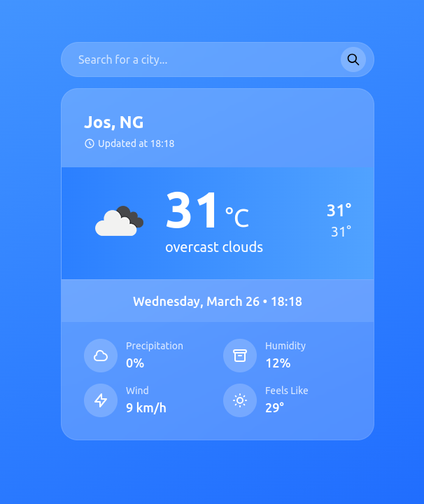

# Weather App 🌤️

A sleek, responsive weather application that displays current weather conditions for any city worldwide using the OpenWeatherMap API.

 <!-- Add a screenshot later -->

## Features ✨
- Real-time weather data (temperature, humidity, wind speed)
- Beautiful gradient UI with glassmorphism design
- City search functionality
- Responsive layout (works on mobile & desktop)
- Dynamic weather icons

## How to Use 🚀
1. **Search for a city** in the search bar
2. View current weather conditions
3. Click the refresh button to update data

## Setup Instructions ⚙️

### 1. Get an API Key
- Sign up at [OpenWeatherMap](https://openweathermap.org/api)
- Get your free API key

### 2. Configure the App
```javascript
// In script.js
const apiKey = "YOUR_API_KEY_HERE"; // Replace with your actual key